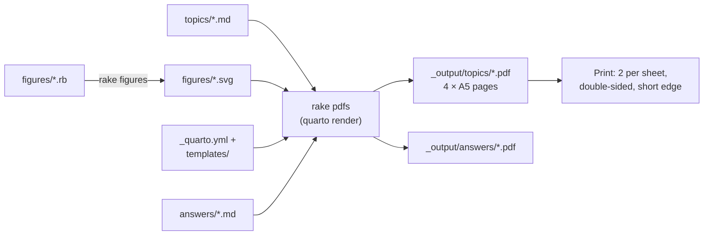

# mathsicles

Bite-sized maths worksheets for Grade 9 and 10 students, written in Markdown and printed as compact A5 sheets. Each topic is small enough to finish in one sitting; topics build on one another so that, lick by lick, a whole subject gets covered.

## How a worksheet is structured

Every topic is four A5 pages. Printed two pages per side, double-sided, it makes a single A4 sheet.

| Side | Left | Right |
|---|---|---|
| Front | **Lesson**: the idea, explained simply, with examples | **Practice**: 2–3 easy exercises applying the lesson |
| Back | **Stretch**: 2–3 harder exercises on the same skill | **Transfer**: an engaging problem where the skill turns up somewhere unexpected |

The Stretch page pushes the skill further. The Transfer page asks students to *recognise* that the skill applies, without being told.

Answers live in separate files, so they can be printed for the teacher and kept off the student's sheet.

## Repository structure

The repository is organised by **strand** (a branch of maths, such as algebra or trigonometry), with one Markdown file per topic.

- **`topics/<strand>/`** holds the worksheets. File names start with a two-digit number giving the teaching order within the strand, followed by a short slug, e.g. `03-expanding-brackets.md`.
- **`topics/<strand>/figures/`** holds the images a strand's topics use, together with the scripts that draw them.
- **`answers/`** mirrors `topics/`: every worksheet has an answer file at the same relative path.
- **`templates/`** holds the page styling shared by all worksheets.
- **`_quarto.yml`** sets the page size, margins and fonts, and tells Quarto which files to build.

Each topic's front matter records its `id` and the ids it `requires`, so the order of the syllabus lives in the files themselves rather than in a list here.

## Writing a topic

1. Create `topics/<strand>/<NN>-<slug>.md`, numbered in teaching order.
2. Start it with front matter:

   ```yaml
   ---
   title: "Collecting like terms"
   id: alg-02
   grade: 9
   requires: [alg-01]
   ---
   ```

   `requires` lists the ids of topics a student should have done first. It keeps the progression explicit.
3. Write four sections, `## Lesson`, `## Practice`, `## Stretch` and `## Transfer`, separated by ``.
4. Use **numbered lists for exercises only**; they are given space for working. Use bullets for examples in the lesson.
5. Write maths in LaTeX notation: `$\tan\theta = \frac{3}{4}$`.
6. Put figures in a `figures/` folder beside the topic, and the script that draws them alongside, so figures can be regenerated after edits.
7. Add the matching answers to `answers/<strand>/<same-name>.md`.
8. Run `bundle exec rake` and check that each section fits on one A5 page.

## Building the PDFs

**Requirements:** [Quarto](https://quarto.org) 1.4 or later, which bundles Typst, so no LaTeX installation is needed; Ruby 3.1 or later with Bundler. Install the gems once from the repository root:

```sh
bundle install
```

Then build:

```sh
bundle exec rake            # regenerate stale figures, then build stale PDFs
bundle exec rake figures    # figures only
bundle exec rake pdfs       # PDFs only
bundle exec rake clobber    # delete all build output
```

Rake rebuilds only what is out of date. A PDF is rebuilt when its Markdown, its strand's figures, `_quarto.yml` or anything in `templates/` changes. A strand's figures are redrawn when a script in its `figures/` folder is newer than the SVGs there. PDFs appear in `_output/`, mirroring the source folders. If `quarto` is not on your `PATH`, set `QUARTO=/path/to/quarto`.

Figures are committed as SVG files, so Quarto alone can also build everything (`quarto render`) or one topic (`quarto render topics/<strand>/<topic>.md`) without Ruby.



## Printing

**Single worksheet:** in the print dialog, choose A4, 2 pages per sheet, double-sided, flip on short edge.

**Booklet of several topics:** merge the PDFs in teaching order, then impose them as a folded A4 booklet. `pdfunite` comes with poppler; `pdfjam` comes with TeX Live.

```sh
pdfunite _output/topics/<strand>/*.pdf merged.pdf
pdfjam --booklet true --landscape --a4paper merged.pdf -o booklet.pdf
```

Alternatively, many printers have a "booklet" mode that does the imposition for you.

## License

Mozilla Public License 2.0. See [LICENSE](LICENSE).
