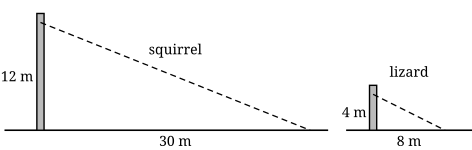

## Opener: which glider wins?

Flying squirrels cannot fly. They glide: they leap from a tree, spread a flap of skin stretched between their front and back legs, and sail downwards. Some lizards, called *Draco*, do the same with flaps of skin held out on their ribs.

Biologists compare gliders by how steeply they come down: how much height they lose for every metre they travel forwards.

Suppose you film two leaps. A squirrel jumps from 12 m up a tree and lands 30 m away along the ground. A lizard jumps from 4 m up and lands 8 m away.

{width=100%}

- Which is the better glider? Guess, and give a reason.
- A friend says: "The squirrel, obviously. It went much further." Is that a fair way to compare?







## Stretch

1. One right triangle has opposite 6 cm and adjacent 8 cm. Another has opposite 9 cm and adjacent 12 cm. Do they have the same angle $\theta$? Explain how you know.
2. A right triangle has $\tan\theta = 0.5$ and an adjacent side of 10 cm. Find the opposite side.

## Back to the gliders

3. For each glide, calculate the tangent of the angle between the glide path and the ground. Which glide is shallower?
4. Was your friend's reason fair? Use your answers to explain.
5. The squirrel wants to reach a tree 40 m away, gliding at the same angle. How high up must it start?
