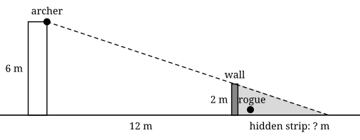

## Opener: can the archer see the rogue?

You are designing an encounter for a tabletop adventure. An archer keeps watch from a tower, her eyes 6 m above the ground. Twelve metres away stands a stone wall, 2 m tall. Behind it, the party's rogue wants to sneak past unseen.

{width=100%}

The archer's line of sight just skims the top of the wall. Behind the wall, anything below that line is hidden. Your game needs a rule: **how deep is the hidden strip?**

- Guess first: is it about 1 m, 3 m or 6 m deep?
- Then draw the scene to scale on squared paper (one square = 1 m) and measure.

Drawing works, but it is slow and only answers one wall. By the end of this sheet you will calculate it for any tower and any wall, which is what a game designer needs to write the rule.







## Stretch

1. One right triangle has opposite 6 cm and adjacent 8 cm. Another has opposite 9 cm and adjacent 12 cm. Do they have the same angle $\theta$? Explain how you know.
2. A right triangle has $\tan\theta = 0.5$ and an adjacent side of 10 cm. Find the opposite side.

## Back to the archer

3. From the archer's eyes to the top of the wall, the sightline drops 4 m over 12 m. What is the tangent of the angle it makes with the horizontal?
4. Beyond the wall the line keeps the same angle until it meets the ground, 2 m lower. How deep is the hidden strip? Was your guess right?
5. Write the rule for your game: a tower of height $h$, a wall of height $w$ at distance $d$. How deep is the hidden strip?
